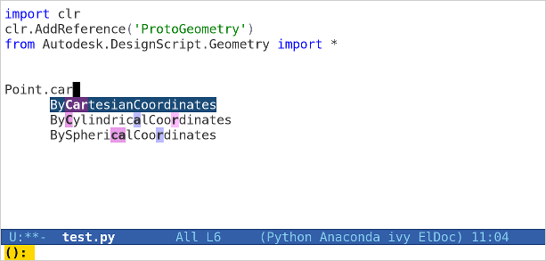

- [Revit Python Stubs](#orgc6e3333)
  - [Libraries](#orgbaf6fc1)
    - [Revit (DB and UI)](#org632a88a)
    - [Dynamo](#org68a3f3d)
    - [System](#orgb646623)
  - [Other resources](#orgac7b62b)

# Revit Python Stubs

Generated Python stubs for Revit and Dynamo libraries.

Useful for autocompetion and code analysis in 3rd party editors such as [PyCharm](https://www.jetbrains.com/pycharm/), [Emacs](https://www.gnu.org/software/emacs/), [Vim](http://www.vim.org/) etc.

Emacs autocompletion using Revit Python Stubs.

## Libraries

### Revit (DB and UI)

[Autodesk.Revit](./Autodesk/Revit/)

Main Revit API.

### Dynamo

1.  Designscript

    [Autodesk.DesignScript.Geometry](./Autodesk/DesignScript/Geometry/)
    
    ProtoGeometry is a wrapper for the designscript control of the [AMS](https://en.wikipedia.org/wiki/ShapeManager) geometry kernel Autodesk provides for Dynamo Geometry creation including the TSpline namespace.

2.  Revit

    [Revit](./Revit/)
    
    Access to the Dynamo wrapped Revit API objects.

3.  RevitServices

    [RevitServices](./RevitServices/)
    
    Access to the Document Manager which contains the Revit document instance.

### System

[System](./System)

Useful .NET System libraries.

## Other resources

[pyRevit](http://eirannejad.github.io/pyRevit/) - IronPython scripts for Autodesk Revit

[revitpythonwrapper](http://revitpythonwrapper.readthedocs.io/en/latest/) - Revit Python Wrapper was created to help Python programmers write Revit API code

[revitpythonshell](https://github.com/architecture-building-systems/revitpythonshell) - An IronPython scripting environment for Autodesk Revit

[revitapidocs](http://www.revitapidocs.com/) - Online Revit API Documentation

[generator3.py](https://github.com/JetBrains/intellij-community/blob/master/python/helpers/generator3.py) - PyCharm's stub generator used to generate these stubs
